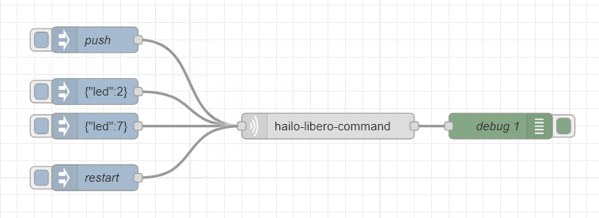

# node-red-contrib-hailo-libero

Node-RED node for Hailo Libero 3.0 hand free trash bin opener for smart home automation.

This package provides Node-RED node to interact with the Hailo Libero 3.0, implementing the session-based HTTP API with auto re-login.



## Installation

Standard installation via Node-RED's palette manager or using npm:

```bash
npm install @foorschtbar/node-red-contrib-hailo-libero
```

## Usage

After installation, you will find a new node in the Node-RED palette under the category "Hailo". You can use this node to send commands to your Hailo Libero 3.0 device.

## Nodes

- **Hailo Libero Command**: Send commands to the Hailo Libero 3.0 device.

### Commands Supported

msg.cmd | msg.payload | Description
--------|--------------|-------------
push    | N/A          | Opens the trash bin lid.
restart | N/A          | Restarts the Hailo Libero device.
settings| `{'led':2}`        | Reconfigures the device settings. Send as JSON. For example, adjusts the LED brightness. Other available options are `pwr` for power and `dist` for the ejection force and detection range.


## Configuration
In the command node, you need to configure the device with the following parameters:

- **Host**: The IP address or hostname of your Hailo Libero 3.0 device.
- **Port**: The port number for your Hailo Libero 3.0 device. Default is `81`.
- **PIN**: The PIN for authentication. Default is `hailo`.

## Example Flow

```json
[
    {
        "id": "3e8fa81acf708d83",
        "type": "hailo-libero-command",
        "z": "0114517e3e5588f5",
        "device": "e41f6e86a9a11551",
        "name": "",
        "x": 600,
        "y": 380,
        "wires": [
            [
                "25a580fb6da8421f"
            ]
        ]
    },
    {
        "id": "a506d85dc25a34f7",
        "type": "inject",
        "z": "0114517e3e5588f5",
        "name": "push",
        "props": [
            {
                "p": "cmd",
                "v": "push",
                "vt": "str"
            }
        ],
        "repeat": "",
        "crontab": "",
        "once": false,
        "onceDelay": 0.1,
        "topic": "",
        "x": 330,
        "y": 280,
        "wires": [
            [
                "3e8fa81acf708d83"
            ]
        ]
    },
    {
        "id": "25a580fb6da8421f",
        "type": "debug",
        "z": "0114517e3e5588f5",
        "name": "debug 1",
        "active": true,
        "tosidebar": true,
        "console": false,
        "tostatus": false,
        "complete": "true",
        "targetType": "full",
        "statusVal": "",
        "statusType": "auto",
        "x": 800,
        "y": 380,
        "wires": []
    },
    {
        "id": "f8a31eeec193c2b9",
        "type": "inject",
        "z": "0114517e3e5588f5",
        "name": "",
        "props": [
            {
                "p": "payload"
            },
            {
                "p": "cmd",
                "v": "settings",
                "vt": "str"
            }
        ],
        "repeat": "",
        "crontab": "",
        "once": false,
        "onceDelay": 0.1,
        "topic": "",
        "payload": "{\"led\":2}",
        "payloadType": "json",
        "x": 330,
        "y": 340,
        "wires": [
            [
                "3e8fa81acf708d83"
            ]
        ]
    },
    {
        "id": "db6e84f78ec11f9d",
        "type": "inject",
        "z": "0114517e3e5588f5",
        "name": "",
        "props": [
            {
                "p": "payload"
            },
            {
                "p": "cmd",
                "v": "settings",
                "vt": "str"
            }
        ],
        "repeat": "",
        "crontab": "",
        "once": false,
        "onceDelay": 0.1,
        "topic": "",
        "payload": "{\"led\":7}",
        "payloadType": "json",
        "x": 330,
        "y": 380,
        "wires": [
            [
                "3e8fa81acf708d83"
            ]
        ]
    },
    {
        "id": "05e5f67a5fc17410",
        "type": "inject",
        "z": "0114517e3e5588f5",
        "name": "restart",
        "props": [
            {
                "p": "cmd",
                "v": "restart",
                "vt": "str"
            }
        ],
        "repeat": "",
        "crontab": "",
        "once": false,
        "onceDelay": 0.1,
        "topic": "",
        "x": 330,
        "y": 440,
        "wires": [
            [
                "3e8fa81acf708d83"
            ]
        ]
    },
    {
        "id": "e41f6e86a9a11551",
        "type": "hailo-libero-device",
        "host": "192.168.0.1",
        "port": "81",
        "protocol": "http",
        "debug": false
    },
    {
        "id": "4fb5fa1e9007224a",
        "type": "global-config",
        "env": [],
        "modules": {
            "node-red-contrib-hailo-libero": "1.0.0"
        }
    }
]
```

## Release workflow

- Change the version in `package.json`
- Update the `package-lock.json` by running `npm install`
- Create commit
- Tag the commit with the new version
- Push the commit and the tag to GitHub `git push origin main --tags`